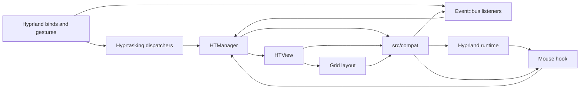

<div align="center">
  <h1>Hyprtasking</h1>
  <p>Powerful workspace management plugin, packed with features.</p>
</div>

> [!Important]
> - Maintained for Hyprland `v0.54.3`, `v0.55.0`, `v0.55.2`, `v0.55.4`, `v0.56.0`, and `v0.56.2`.

## This Fork

This repository started from the original Hyprtasking project and has diverged
into a narrower, maintenance-first branch.

The main differences from the upstream fork source are:

- this branch is maintained for explicit audited Hyprland targets, currently
  `0.54.3` and `0.55.0`, instead of trying to span a wide range of compositor
  releases
- Hyprland-sensitive behavior is pushed behind `src/compat/`, with explicit
  compat ownership, runtime wrappers, and audited hook contracts
- the public runtime surface is intentionally small: grid overview, mouse
  trigger/selection/drag/drop, gestures, directional movement, submap-backed
  keyboard selection, and health checks
- release validation is much stricter, with version-contract checks, compat
  audits, boundary audits, smoke tests, manual runtime checklists, and
  machine-readable outputs for tooling
- overview stability has been hardened around renderer re-entry, focus handoff,
  hover and keyboard selection, and runtime lifecycle edge cases
- overview mouse interaction now uses a direct `CInputManager::onMouseButton`
  hook on the supported runtime, which fixed the drag and right-click selection
  regression that appeared after the earlier refactors
- bare key bindings for overview navigation now use a Hyprland submap that the
  plugin enters/exits automatically, which eliminates keypress interference
  during normal workspace use
- gated runtime tracing is built in through
  `plugin:hyprtasking:debug:trace`, so maintainers can enable deep diagnostics
  without re-adding ad hoc logging
- maintainer and user-facing documentation now lives in `docs/`, including the
  debugging playbook, compat contract, troubleshooting guide, and the incident
  write-up for the overview input regression

If you want the original wider-compatibility project posture, read the upstream
repository. If you want the branch that tracks the current maintenance work,
testing, and debugging workflow described in this README, use this repository.

https://github.com/user-attachments/assets/8d6cdfd2-2b17-4240-a117-1dbd2231ed4e

#### [Jump To Installation](#Installation)

#### [See Configuration](#Configuration)

## Roadmap

- [x] Grid overview
- [x] Mouse controls
    - [x] Exit into workspace (hover, click)
    - [x] Drag and drop windows
- [x] Keyboard controls
    - [x] Switch workspaces with direction
- [x] Multi-monitor support (tested)
- [x] Monitor scaling support (tested)
- [x] Animation support
- [x] Configurability
    - [x] Number of visible workspaces
    - [x] Toggle behavior
    - [x] Toggle keybind
- [x] Touch and gesture support

## Installation

### AUR

```
yay -S hyprtasking
paru -S hyprtasking
```

### Hyprpm

```
hyprpm add https://github.com/douglas/hyprtasking
hyprpm enable hyprtasking
```

### Nix

Add hyprtasking to your flake inputs and pin Hyprland to the supported
target you run. This example uses `v0.55.0`; `v0.54.3` is also supported.
```nix
# flake.nix
{
  inputs = {
    hyprland.url = "github:hyprwm/Hyprland/v0.55.0";

    hyprtasking = {
      url = "github:douglas/hyprtasking";
      inputs.hyprland.follows = "hyprland";
    };
  };
  # ...
}

```

Include the plugin in the hyprland home manager options

```nix
# home.nix
{ inputs, ... }:
{
  wayland.windowManager.hyprland = {
    plugins = [
      inputs.hyprtasking.packages.${pkgs.system}.hyprtasking
    ];
  }
}
```

### Manual

To build, have hyprland headers installed on the system and then:

```
meson setup build
cd build && meson compile
```

Then use `hyprctl plugin load` to load the absolute path to the `.so` file:

```
hyprctl plugin load "$(realpath libhyprtasking.so)"
```

`hyprctl reload` only reloads configuration and does not reload the plugin
binary. After rebuilding the plugin, unload/reload the `.so` explicitly.

For a quick live smoke check after the plugin is loaded:

```
bash scripts/smoke-live.sh all
```

Before updating the plugin to a new Hyprland package/runtime, run the compat audit against the
matching Hyprland source tree. The source tree is audit-only; builds must use the installed Arch
`hyprland` package headers from `pkg-config`:

```
bash scripts/audit-compat.sh /path/to/Hyprland
bash scripts/audit-compat-surface.sh /path/to/Hyprland
bash scripts/audit-compat-coverage.sh
bash scripts/update-supported-hyprland.sh /path/to/Hyprland
```

To verify the repo still keeps direct Hyprland internals behind `src/compat/`:

```
bash scripts/audit-boundary.sh
bash scripts/audit-config-keys.sh
bash scripts/audit-guidelines.sh
```

For tooling, the boundary audit also supports machine-readable output:

```
AUDIT_BOUNDARY_FORMAT=json bash scripts/audit-boundary.sh
AUDIT_CONFIG_KEYS_FORMAT=json bash scripts/audit-config-keys.sh
```

Supported smoke subcommands:

- `all`: unload/load the plugin, verify dispatcher registration, run runtime safety probes, run toggle/move probes, then reload Hyprland
- `stress`: run a heavier live cycle with repeated unload/load, toggle/move, reload, and reload-open checks
- `dispatchers`: verify that `toggle`, `move`, `select`, `commit`, and
  `health` dispatchers are registered and still return the expected probe
  responses without changing overview state
- `safety`: verify invalid grid dimensions, gesture distances, mouse button
  conflicts, and gesture finger conflicts disable runtime cleanly
- `load-unload`: validate one or more live unload/load cycles for `build/libhyprtasking.so`
- `toggle`: validate toggle and directional move dispatchers
- `reload`: reload Hyprland and wait for the plugin to become ready again
- `reload-open`: reload Hyprland while the overview is open, then verify the plugin still responds
- `manual`: print the manual compositor checks that still need eyes on the result

Optional environment:

- `HYPRLAND_INSTANCE_SIGNATURE`: target a specific live Hyprland session. If unset, the script picks the first active instance from `hyprctl instances`.
- `PLUGIN_PATH`: override the plugin path used by `load-unload`
- `LOAD_UNLOAD_CYCLES`: number of unload/load cycles to run for `load-unload`
- `TOGGLE_CYCLES`: number of open/move/close toggle cycles to run for `toggle` or `all`
- `RELOAD_CYCLES`: number of reload cycles to run for `reload`, `reload-open`, or `all`
- `PRINT_MANUAL_FOLLOW_UP`: set to `0` to suppress the checklist print at the end of `all` or `stress`

`stress` uses stronger defaults when the cycle variables are left at `1`:
- `LOAD_UNLOAD_CYCLES=3`
- `TOGGLE_CYCLES=3`
- `RELOAD_CYCLES=2`

## Maintainer Docs

The repo-specific maintenance and debugging docs live under `docs/`:

- [`docs/debugging-playbook.md`](docs/debugging-playbook.md): step-by-step
  workflow for diagnosing build, compat, hook, input, render, and focus
  regressions
- [`docs/overview-input-regression.md`](docs/overview-input-regression.md):
  distilled lessons from the overview click/drag regression that required
  moving click handling to the direct `CInputManager::onMouseButton` hook
- [`docs/architecture.md`](docs/architecture.md): diagrams for the current
  public runtime surface, reload lifecycle, and release gates
- [`docs/compat-contract.md`](docs/compat-contract.md): the Hyprland-facing
  compat ownership map and drift-prone contracts
- [`docs/supported-hyprland.md`](docs/supported-hyprland.md): supported
  patch-version matrix and one-command update workflow
- [`docs/troubleshooting.md`](docs/troubleshooting.md): user-facing guide for
  diagnosing input problems including bare-key binding interference and
  input method conflicts on Wayland

## Current Status

This branch is no longer just the original feature set with small local fixes.
The current maintenance work has added:

- a dedicated compatibility layer for Hyprland-facing runtime and renderer
  contracts
- a pruned dispatcher/config surface focused on the core workflows this branch
  actively verifies
- repo-local release gates and smoke scripts that distinguish version drift,
  hook startup failures, dispatcher registration failures, and runtime behavior
  regressions
- structured JSON output for release, compat, boundary, and manual-check flows
- explicit maintainer docs for debugging, incident learnings, and compat
  ownership
- a built-in trace path at `/tmp/hyprtasking-trace.log`, gated by
  `plugin:hyprtasking:debug:trace`
- the direct input-manager mouse-button hook that restored stable drag and
  right-click workspace selection on the supported Hyprland line
- automatic submap management for bare key bindings so overview keyboard
  navigation does not interfere with normal keypress delivery

## Runtime Surface



The only public dispatchers are `toggle`, `move`, `select`, `commit`, and
`health`. Bare-key navigation uses the
`hyprtasking` submap with `select` and `commit`; config reload always cancels
active overview runtime state and reinitializes grid positions.

## Updating Hyprland Compatibility

Hyprtasking is maintained for explicit audited Hyprland targets. The current
supported targets are `0.54.3` and `0.55.0`.

Update workflow:

1. Verify that the installed package headers and the live runtime are aligned:

```
bash scripts/check-version-contract.sh
```

2. Run the supported-version update workflow against the target Hyprland source tree:

```
bash scripts/update-supported-hyprland.sh /path/to/Hyprland
```

3. If any audit fails, first confirm that the target tree is one of the
   supported exact versions, then update only the compat layer in `src/compat/`.
4. Rebuild and run:

```
meson compile -C build
meson test -C build
bash scripts/smoke-live.sh all
```

5. Finish with the manual compositor checks printed by `bash scripts/smoke-live.sh manual`.

For the same flow through one command:

```
HYPRLAND_SOURCE=/path/to/Hyprland bash scripts/release-check.sh
```

For a single local release-prep command, run:

```
bash scripts/release-check.sh
```

`release-check.sh` defaults to the heavier `stress` smoke mode. Override with
`SMOKE_MODE=all` if you want the lighter path, or set `PRINT_MANUAL_CHECKLIST=0`
to skip printing the manual compositor checklist. The script suppresses the
intermediate smoke-script reminder so the manual checklist is printed once. It
also runs a repo-local compat boundary audit plus a `load-unload` cycle and
separate `dispatchers` probe first so architectural regressions and
hook/registration failures are easier to distinguish from later runtime smoke
failures. It always runs `scripts/check-version-contract.sh` first. If
`HYPRLAND_SOURCE` is set, it then runs `scripts/audit-compat.sh` and
`scripts/audit-compat-surface.sh` against that source tree before continuing
with the boundary audit, normal build, test, smoke, and manual-check flow.
The default build directory is `build`; if that directory is absent and a local
`build-055` directory exists, the script uses `build-055`. Set `BUILD_DIR` to
override this explicitly.

To print only one manual scenario after the automated checks, set
`MANUAL_SCENARIO`:

```
MANUAL_SCENARIO=gesture bash scripts/release-check.sh
```

For tooling, request one machine-readable result for the full release gate:

```
RELEASE_CHECK_FORMAT=json HYPRLAND_SOURCE=/path/to/Hyprland bash scripts/release-check.sh
```

`audit-compat.sh` prints the detected Hyprland version, the accepted support
targets, and the required hook/API contracts it verified so version drift is
easier to diagnose during updates. On failure, it also prints the missing
contract list and the first place to patch. The full ownership map lives in
[`docs/compat-contract.md`](docs/compat-contract.md).

Hook discovery uses `findFunctionsByName()` and requires an exact signature
match. Ambiguous or missing hook symbols disable Hyprtasking for the session
instead of falling back to deprecated lookup paths.

`audit-compat-surface.sh` does the same for the runtime-sensitive wrapper
surface under `src/compat/`, covering focus, cursor, drag-controller,
workspace/window/monitor accessor, and render-pass contracts that previously
required only manual review after a Hyprland bump.

`check-version-contract.sh` is the hard gate for the supported targets. It fails if
the installed `hyprland` package, the running Hyprland instance, or the
optional audited source tree are not aligned on the same supported exact
version.

`audit-boundary.sh` also enforces that direct Hyprland focus mutation stays out
of layout/render code, so overview rendering cannot silently start reasserting
monitor focus again. It also fails if render-stage style entrypoints reappear
outside `src/compat/`, which helps catch render-recursion regressions before
release.

`audit-config-keys.sh` enforces that every config key used through `HTConfig`
is registered in `initializeConfig()`. This prevents render-path null
dereferences from missing config registrations. Runtime code reads a typed
snapshot refreshed at plugin startup, config reload, and runtime readiness
checks, so grid, mouse, gesture, and trace settings are validated before
input/render paths use them.

`audit-guidelines.sh` hard-gates key Hyprland plugin best practices for this
branch: no thread primitives in runtime code, and no new function-hook call
sites or function-hook removal sites outside the approved compat/runtime hook
layer.

When `RELEASE_CHECK_FORMAT=json` is used, `release-check.sh` now includes
structured `audit_results` for the compat, compat-surface, compat-coverage,
boundary, and config-keys audits, plus the selected `manual_checklist`.

Audit exit codes:

- `2`: required Hyprland source file missing
- `3`: unsupported Hyprland target for this plugin branch
- `4`: supported target, but one or more audited contracts drifted

For tooling or CI wrappers, request machine-readable output:

```
AUDIT_FORMAT=json bash scripts/audit-compat.sh /path/to/Hyprland
AUDIT_FORMAT=json bash scripts/audit-compat-surface.sh /path/to/Hyprland
```

The manual compositor checklist is also available directly:

```
bash scripts/manual-runtime-check.sh
```

For tooling, request the same checklist in machine-readable form:

```
CHECKLIST_FORMAT=json bash scripts/manual-runtime-check.sh typing-focus
```

Supported checklist scenarios:

- `all`: print the full manual checklist
- `drag`: focus on overview drag/drop behavior
- `typing-focus`: focus on immediate typing and `Ctrl+L` after right-click workspace selection
- `gesture`: focus on gesture interruption and recovery
- `reload-open`: focus on reload while the overview is visible
- `monitor-remove`: focus on monitor removal while runtime state is active
- `render-reentry`: focus on reopening the overview immediately after workspace selection and reload
- `hook-sunset`: re-test the event-bus mouse path on every supported Hyprland
  target before keeping the direct mouse-button hook

When `RELEASE_CHECK_FORMAT=json` is used, `release-check.sh` now includes the
selected manual checklist as a nested `manual_checklist` object, so wrappers can
carry the required human verification steps alongside the automated stage
results.

## Usage

### Opening Overview

- Bind `hyprtasking:toggle, all` to a keybind to open/close the overlay on all monitors.
- Bind `hyprtasking:toggle, cursor` to a keybind to open the overlay on one monitor and close on all monitors.
- Swipe up/down on a touchpad device to open/close the overlay on one monitor.
- See [below](#Configuration) for configuration options.

### Interaction

- Workspace Transitioning:
    - Open the overlay, then use **right click** to switch to a workspace
    - Use **arrow keys** to navigate between workspaces and **Enter** to commit (requires submap config, see [Configuration](#configuration))
    - Use the directional dispatchers `hyprtasking:move` to switch to a workspace
- Window management:
    - **Left click** to drag and drop windows around

## Configuration

Example below:

```
bind = SUPER, tab, hyprtasking:toggle, cursor
bind = SUPER, space, hyprtasking:toggle, all

bind = SUPER, H, hyprtasking:move, left
bind = SUPER, J, hyprtasking:move, down
bind = SUPER, K, hyprtasking:move, up
bind = SUPER, L, hyprtasking:move, right

# Bare key bindings (no modifier) must go inside a Hyprland submap so they
# only intercept keypresses while the overview is open. The plugin enters
# the "hyprtasking" submap automatically when the overview opens and exits
# it when the overview closes. Without a submap, bare key bindings cause
# Hyprland to intercept every keypress globally — even when the overview is
# closed — which drops the next keypress in the application.
submap = hyprtasking
bind = , LEFT, hyprtasking:select, left
bind = , RIGHT, hyprtasking:select, right
bind = , UP, hyprtasking:select, up
bind = , DOWN, hyprtasking:select, down
bind = , RETURN, hyprtasking:commit,
bind = , ESCAPE, hyprtasking:toggle, cursor
submap = reset

# Important: define these binds in sourced config files (`source = ...`) or load
# them once (`exec-once = hyprctl keyword source ...`). Re-sourcing the same
# submap block repeatedly at runtime stacks duplicate binds, which can make one
# arrow keypress navigate multiple workspaces.

plugin {
    hyprtasking {
        drag_button = 0x110 # left mouse button
        select_button = 0x111 # right mouse button
        # for other mouse buttons see <linux/input-event-codes.h>

        gestures {
            enabled = true
            move_fingers = 3
            move_distance = 300
            open_fingers = 4
            open_distance = 300
            open_positive = true
        }

        grid {
            rows = 3
            cols = 3
            loop = false
        }
    }
}
```

### Binding recipes

Selection + Enter recipe:

```ini
bind = SUPER, tab, hyprtasking:toggle, cursor
submap = hyprtasking
bind = , LEFT, hyprtasking:select, left
bind = , RIGHT, hyprtasking:select, right
bind = , UP, hyprtasking:select, up
bind = , DOWN, hyprtasking:select, down
bind = , RETURN, hyprtasking:commit,
bind = , ESCAPE, hyprtasking:toggle, cursor
submap = reset
```

Quick mismatch check:

```bash
hyprctl plugin list
hyprctl keyword source ~/.config/hypr/personal-hyprtasking.conf
hyprctl dispatch hyprtasking:health
```

If `keyword source` prints `invalid dispatcher` and your config still uses
`hyprtasking:navigate` or `hyprtasking:commit_selection`, switch those binds to
`hyprtasking:select` and `hyprtasking:commit`.
Configs that depended on conditional wrapper dispatchers should instead use
the `hyprtasking` submap shown above so bare keys only exist while the overview
is open.

### Dispatchers

- `hyprtasking:toggle, ARG` takes in 1 argument that is either `cursor` or `all`
    - if the argument is `all`, then
        - if all overviews are hidden, then all overviews will be shown
        - otherwise all overviews will be hidden
    - if the argument is `cursor`, then
        - if current monitor's overview is hidden, then it will be shown
        - otherwise all overviews will be hidden

- `hyprtasking:move, ARG` takes in 1 argument that is one of `up`, `down`, `left`, `right`
    - when dispatched, hyprtasking will switch workspaces with a nice animation

- `hyprtasking:select, ARG` takes in 1 argument: one of `up`, `down`, `left`, `right`
    - directional selection updates the keyboard highlight; use `hyprtasking:commit` to switch
    - intended for use inside the `hyprtasking` submap so that bare arrow keys work only while the overview is open

- `hyprtasking:commit` switches to the currently selected workspace and closes the overview
    - intended for use inside the `hyprtasking` submap so that bare Enter works only while the overview is open

- `hyprtasking:health` prints runtime status and the disable reason (if runtime
  was disabled) in both logs and notification output. Pass `json` for
  machine-readable hook and Event::bus listener diagnostics.

Reload behavior is not configurable: `hyprctl reload` cancels active overview
runtime state and reinitializes grid positions so the compositor never keeps a
half-open overview across a config reload.

Invalid safety-sensitive config disables Hyprtasking for the current session and
passes input/rendering back to Hyprland. This includes non-positive grid
dimensions, duplicate drag/select mouse buttons, duplicate gesture finger
counts, and non-positive gesture distances. Run
`hyprctl dispatch hyprtasking:health json` to inspect the failure source and
reason.

### Gesture recipes

`open_fingers` and `move_fingers` should use different values to avoid one
gesture driving both actions.

- 3-finger swipe up/down toggles overview, 4-finger swipe moves workspaces:
  - `gestures:open_fingers = 3`
  - `gestures:move_fingers = 4`
- 4-finger swipe up/down toggles overview, 3-finger swipe moves workspaces:
  - `gestures:open_fingers = 4`
  - `gestures:move_fingers = 3`

Use `gestures:open_positive` to pick which swipe direction opens the overview:
`1` means positive swipe opens and negative closes, `0` reverses this.

### Config Options

All options are prefixed with `plugin:hyprtasking:`.
Visual styling uses fixed built-in defaults.

| Option | Type | Description | Default |
| --- | --- | --- | --- |
| `debug:trace` | `Hyprlang::INT` | Enables runtime trace output to `/tmp/hyprtasking-trace.log` for debugging. Use a config entry for persistent tracing. Runtime toggles with `hyprctl keyword plugin:hyprtasking:debug:trace 1` are applied after a config reload or plugin reload. | `0` |
| `drag_button` | `Hyprlang::INT` | The mouse button to use to drag windows around. Must differ from `select_button`; conflicts disable runtime for safety. | `0x110` |
| `select_button` | `Hyprlang::INT` | The mouse button to use to select a workspace. Must differ from `drag_button`; conflicts disable runtime for safety. | `0x111` |
| `gestures:enabled` | `Hyprlang::INT` | Whether or not to enable gestures | `true` |
| `gestures:move_fingers` | `Hyprlang::INT` | The number of fingers to use for the "move" gesture. Keep different from `open_fingers` to avoid gesture overlap. | `3` |
| `gestures:move_distance` | `Hyprlang::FLOAT` | How large of a swipe on the touchpad corresponds to the width of a workspace. Must be `> 0`; invalid values disable runtime for safety. | `300.f` |
| `gestures:open_fingers` | `Hyprlang::INT` | The number of fingers to use for the open/close gesture. Keep different from `move_fingers` to avoid gesture overlap. | `4` |
| `gestures:open_distance` | `Hyprlang::FLOAT` | How large of a swipe on the touchpad is needed for the "open" gesture. Must be `> 0`; invalid values disable runtime for safety. | `300.f` |
| `gestures:open_positive` | `Hyprlang::INT` | `true` if swiping up should open the overlay, `false` otherwise | `true` |
| `grid:rows` | `Hyprlang::INT` | The number of rows to display on the grid overlay. Must be `>= 1`; invalid values disable runtime for safety. | `3` |
| `grid:cols` | `Hyprlang::INT` | The number of columns to display on the grid overlay. Must be `>= 1`; invalid values disable runtime for safety. | `3` |
| `grid:loop` | `Hyprlang::INT` | When enabled, moving right at the far right of the grid will wrap around to the leftmost workspace, etc. | `false` |
