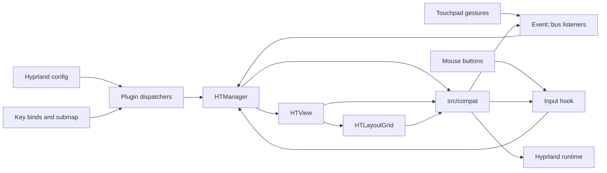
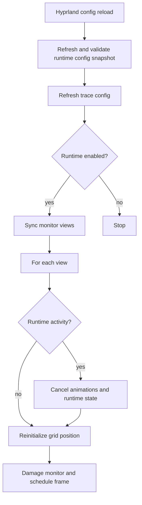

# Architecture

Hyprtasking is intentionally narrow on the supported `0.54.3` and `0.55.0`
Hyprland targets.
The public surface is the overview itself, mouse interaction, gestures, the
core dispatchers, runtime health, and audited compat wrappers.

## Runtime Surface

Supported dispatchers:

- `hyprtasking:toggle`
- `hyprtasking:move`
- `hyprtasking:select`
- `hyprtasking:commit`
- `hyprtasking:health`

Bare arrow keys and Enter are supported only through the `hyprtasking` submap.
The plugin enters that submap when a view becomes interactively active and
returns to the default submap when all views leave that state.

Event::bus listeners are installed through `src/compat/runtime_compat.cpp` for
mouse movement, gestures, config reloads, and monitor changes. Missing listener
registration is treated as a startup failure and is visible in
`hyprtasking:health json`.

## Reload Lifecycle

Reload behavior is deliberately not configurable. A reload always leaves each
view in a clean grid position, and any active, closing, or navigating overview
state is canceled before rendering continues.

Config is read into a typed runtime snapshot at startup, config reload, and
runtime readiness checks that can observe transient `hyprctl keyword` changes.
Invalid safety-sensitive values, including grid dimensions, duplicate mouse
buttons, duplicate gesture finger counts, and non-positive gesture distances,
disable Hyprtasking for the session instead of trying to continue with
ambiguous input or render behavior.

## Release Gate

```mermaid
flowchart LR
    version[Version contract]
    compat[Compat audits]
    coverage[Compat coverage]
    boundary[Boundary audit]
    guidelines[Guideline audit]
    config[Config-key audit]
    build[Build]
    tests[Logic tests]
    live[Live smoke]
    manual[Manual checklist]

    version --> compat
    compat --> coverage
    coverage --> boundary
    boundary --> guidelines
    guidelines --> config
    config --> build
    build --> tests
    tests --> live
    live --> manual
```

`RELEASE_MODE=offline` runs the version-independent local stages and the
Hyprland source audits without touching a live compositor. The full mode adds
load/unload, dispatcher, live smoke, and manual checklist stages.
