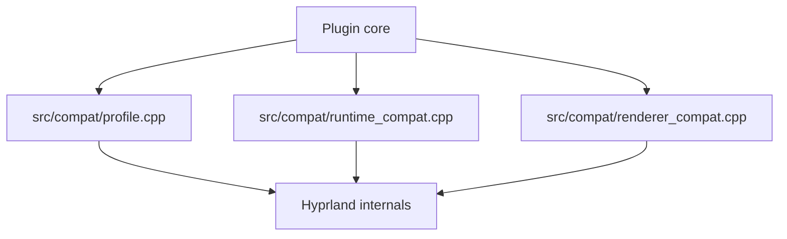

# Compat Contract

Hyprtasking is maintained for Hyprland `0.54.3` and `0.55.0`.

The current runtime shape is diagrammed in [`architecture.md`](architecture.md).
The update workflow is:

1. Build against the installed Arch `hyprland` package headers only.
2. Run `bash scripts/check-version-contract.sh` to confirm the installed package and live runtime are aligned on the same supported exact version.
3. Run `HYPRLAND_SOURCE=/path/to/Hyprland bash scripts/release-check.sh` to audit a matching Hyprland source tree.
4. If `scripts/audit-compat.sh` or `scripts/audit-compat-surface.sh` fails, patch the relevant file under `src/compat/`.
5. Re-run the same command until the version contract, audits, build, tests, smoke checks, and manual scenario output are clean.

## Ownership

These files are the plugin-side compatibility boundary:

- `src/compat/profile.cpp`
  - Supported Hyprland target gating
  - Hook/symbol contract resolution, including exact signature lookup
  - Input hook contract resolution for `CInputManager::onMouseButton`
  - Plugin API version compatibility assumptions
- `src/compat/renderer_compat.cpp`
  - Renderer hook wrappers
  - Workspace/window/monitor render-time access
  - Damage and render-pass helpers
- `src/compat/runtime_compat.cpp`
  - Focus, cursor, seat, drag-controller, and compositor action wrappers
  - Original call-through helpers for drift-prone runtime hooks

Contract definitions for audited Hyprland surfaces are centralized in:

- `scripts/compat-contract-manifest.sh`
- `scripts/contracts/core.generated.tsv`
- `scripts/contracts/surface.generated.tsv`
- `scripts/contracts/core.overrides.tsv`
- `scripts/contracts/surface.overrides.tsv`

Surface contracts may include alternatives with `@@@` for intentional
supported-version drift. Each `|||` segment is still required, but any `@@@`
option inside a path or pattern may satisfy that segment. This is how the audit
tracks `0.54.3` and `0.55.0` differences such as the mouse-button hook
signature, renderer namespace move, config animation lookup, workspace-move
alpha storage, and public accessor placement for monitor, workspace, and window
geometry.

Contract baselines are regenerated with:

- `bash scripts/generate-compat-contract.sh /path/to/Hyprland`
- `bash scripts/update-supported-hyprland.sh /path/to/Hyprland`

Compat symbol coverage is enforced with:

- `bash scripts/audit-compat-coverage.sh`

## Audited Contracts

The compat audit currently checks these Hyprland-side contracts:

| Contract | Hyprland location | Likely plugin touchpoint |
| --- | --- | --- |
| public version API | `src/plugins/PluginAPI.hpp` | `src/compat/profile.cpp` |
| version API implementation | `src/plugins/PluginAPI.cpp` | `src/compat/profile.cpp` |
| `renderWorkspace` symbol | `src/render/Renderer.cpp` | `src/compat/profile.cpp`, `src/compat/renderer_compat.cpp` |
| `shouldRenderWindow` symbol | `src/render/Renderer.cpp` | `src/compat/profile.cpp`, `src/compat/renderer_compat.cpp` |
| `renderWindow` symbol | `src/render/Renderer.cpp` | `src/compat/profile.cpp`, `src/compat/renderer_compat.cpp` |
| `isSolitaryBlocked` symbol | `src/helpers/Monitor.hpp` | `src/compat/profile.cpp` |
| `onMouseButton` symbol | `src/managers/input/InputManager.cpp` | `src/compat/profile.cpp`, `src/plugin/runtime.cpp` |
| plugin API version check | `src/plugins/PluginSystem.cpp` | `src/compat/profile.cpp` |

## Runtime Compat Surface

`scripts/audit-compat-surface.sh` now also checks these Hyprland-side contracts:

| Contract | Hyprland location | Likely plugin touchpoint |
| --- | --- | --- |
| input mouse helpers | `src/managers/input/InputManager.hpp` | `src/compat/runtime_compat.cpp` |
| mouse bind mode API | `src/managers/KeybindManager.hpp` | `src/compat/runtime_compat.cpp` |
| cursor override controller | `src/managers/cursor/CursorShapeOverrideController.hpp` | `src/compat/runtime_compat.cpp` |
| layout drag controller entrypoint | `src/layout/LayoutManager.hpp` | `src/compat/runtime_compat.cpp` |
| drag controller state accessors | `src/layout/supplementary/DragController.hpp` | `src/compat/runtime_compat.cpp` |
| pointer warp API | `src/managers/PointerManager.hpp` | `src/compat/renderer_compat.cpp` |
| compositor lookup and workspace APIs | `src/Compositor.hpp` | `src/compat/runtime_compat.cpp`, `src/compat/renderer_compat.cpp` |
| monitor focus and render fields | `src/helpers/Monitor.hpp` | `src/compat/renderer_compat.cpp` |
| workspace render state fields | `src/desktop/Workspace.hpp` | `src/compat/renderer_compat.cpp` |
| window animation and workspace fields | `src/desktop/view/Window.hpp` | `src/compat/runtime_compat.cpp`, `src/compat/renderer_compat.cpp` |
| render pass clear API | `src/render/pass/Pass.hpp` | `src/compat/renderer_compat.cpp` |
| hook removal API | `src/plugins/PluginAPI.hpp` | `src/compat/renderer_compat.cpp`, `src/plugin/runtime.cpp` |
| renderer singleton and pass handles | `src/render/Renderer.hpp` | `src/compat/renderer_compat.cpp` |
| config and animation config handles | `src/config/ConfigManager.hpp`, `src/config/shared/animation/AnimationTree.hpp` | `src/compat/runtime_compat.cpp` |

These still usually require inspection after a Hyprland bump even if both audits
pass:

- direct input hook behavior for `CInputManager::onMouseButton` versus the
  cancellable event-bus mouse-button path
- event bus listener wiring in `src/compat/runtime_compat.cpp`
- animation/config-backed helper wiring in `src/compat/runtime_compat.cpp`
- renderer hook behavior in `src/compat/renderer_compat.cpp`, especially whether `findFunctionsByName` resolves exact signatures at runtime
- `changeWorkspace` semantics and visibility animation behavior in `src/compat/renderer_compat.cpp`

## Remaining Hooks

Hyprtasking keeps direct function hooks only where the public plugin API does
not provide the needed lifecycle control:

- `CInputManager::onMouseButton`: required because the cancellable event-bus
  mouse-button path did not preserve stable drag/drop and right-click selection
  behavior on the supported Hyprland targets.
- `CHyprRenderer::renderWorkspace`: required to render the overview grid in
  the compositor render path without a separate surface.
- `CHyprRenderer::shouldRenderWindow`: required to hide overview-managed
  windows from their normal workspace render while the grid owns them.
- `CHyprRenderer::renderWindow`: resolved for original window render
  call-through inside overview cells.
- `CMonitor::isSolitaryBlocked`: required so fullscreen and solitary
  workspaces remain renderable inside overview cells.

Hook cleanup goes through Hyprland's removal API so unload tears down the
registered trampoline rather than only calling the hook object's raw unhook
method.

## Config Policy

The public config surface is intentionally limited to grid size, grid looping,
mouse buttons, gestures, and trace logging. Hyprland `0.55.0` builds register
those values with `addConfigValueV2`; `0.54.3` builds keep the legacy
`addConfigValue` path.

Runtime code consumes a typed snapshot refreshed at plugin startup, config
reload, and runtime readiness checks that can observe transient
`hyprctl keyword` changes. Invalid safety-sensitive settings disable
Hyprtasking for the session and return input/render control to Hyprland.

## Hyprland Best-Practice Checklist

- Gate runtime support on exact Hyprland package/runtime versions.
- Register dispatchers with `addDispatcherV2`.
- Prefer `Event::bus` listeners through `src/compat/runtime_compat.cpp` for
  cancellable events before adding hooks.
- Treat missing `Event::bus` listeners as startup failures instead of silently
  running with a partially wired runtime.
- Re-run `bash scripts/manual-runtime-check.sh hook-sunset` on every supported
  Hyprland target before keeping the direct mouse-button hook for a release.
- Keep drift-prone Hyprland methods and fields behind `src/compat/` wrappers.
- Keep deprecated Hyprland plugin APIs only in audited `0.54.3` config
  registration/read compatibility paths.
- Run build, tests, boundary/config/guideline audits, compat audits for each
  supported source tree, live smoke, and manual fullscreen/gesture checks before
  release.

If a Hyprland update breaks runtime behavior without failing the audit, start with those files.

## Track Workflow

Use `main` for stable supported target fixes. Future Hyprland adaptation can
start in a preview branch when the next release needs investigation.

Track policy and automation details live in `docs/maintenance-tracks.md`.
